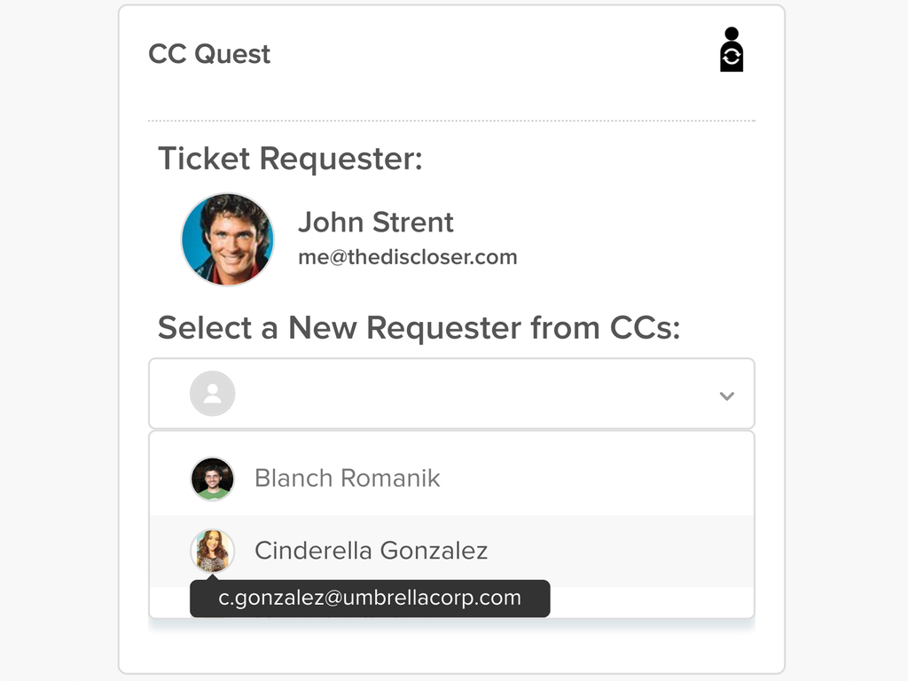
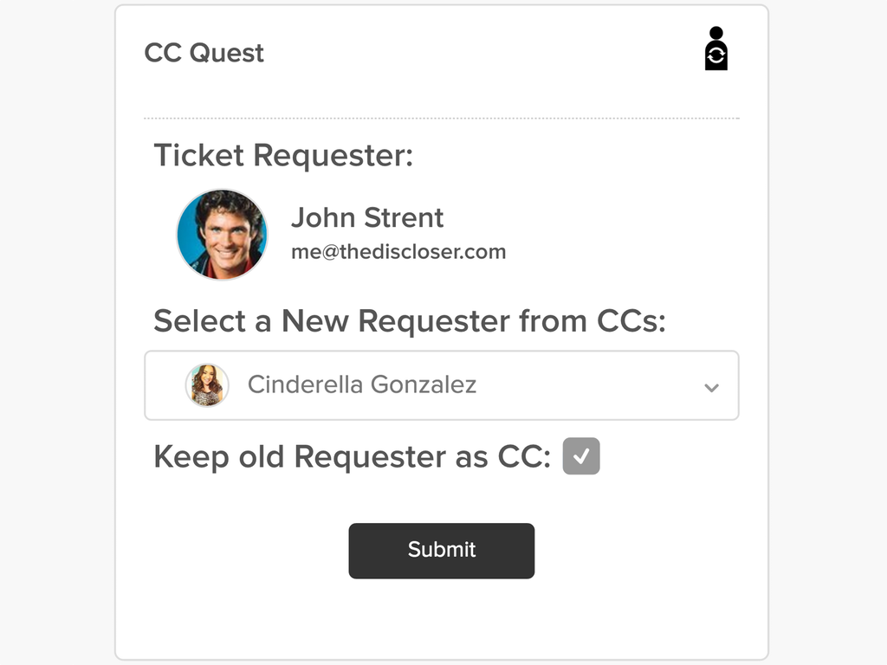
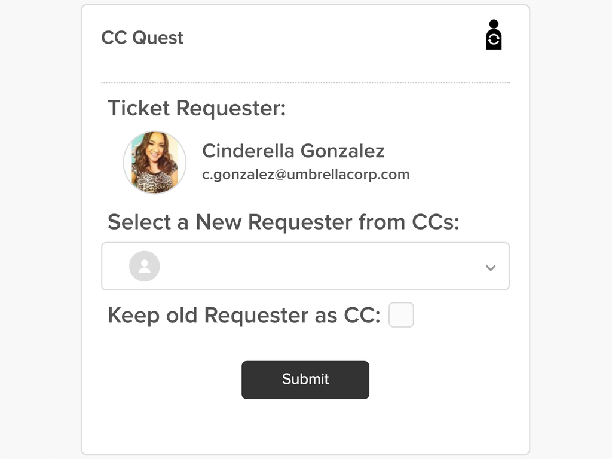
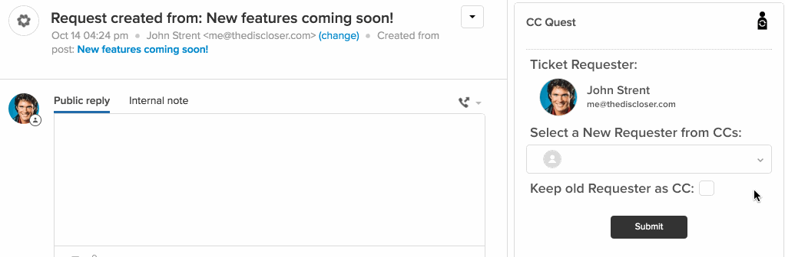

⚠️ Use of this software is subject to important terms and conditions as set forth in the [License](https://aculligan.github.io/license) page ⚠️

# CC Quest

Make CCs the Requesters of Zendesk tickets 

### The App looks at the ticket information and:

* Displays the current Ticket Requester.
* Creates an alphabetical list of all the CCs in the ticket.
* Let's you choose one CC to make the new Ticket Requester.
* Gives you the option of adding the old Ticket Requester to the list of CCs.

#### This App is available in: 

* English

Please submit bug reports [here](https://github.com/aculligan/CC_Quest/issues).

### Screenshots:

### Version:

✅ 🆕 Version 1.1 published [here](https://www.zendesk.com/apps/cc-quest/).

📝 🔜 Version 1.1.1 will include: 
* Translation for Spanish.
